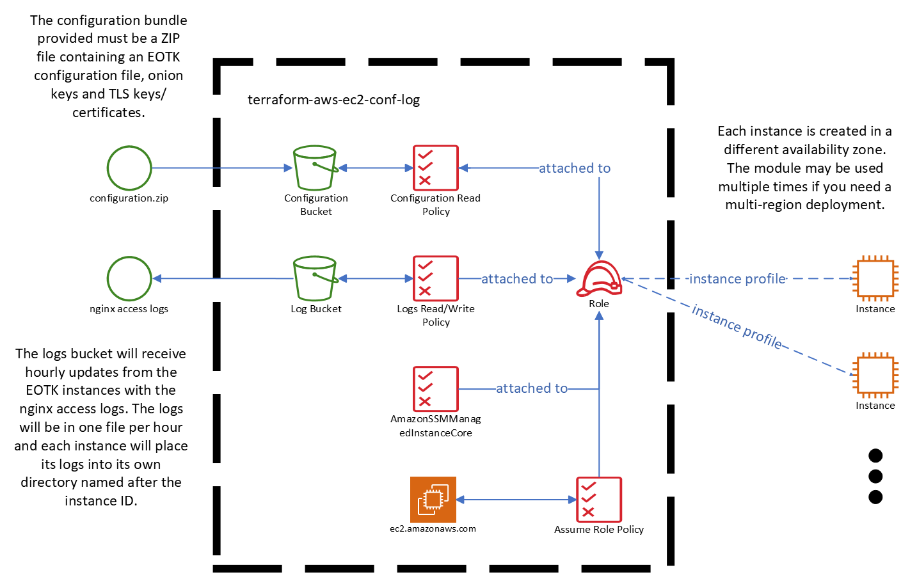

<!-- markdownlint-disable -->
# terraform-aws-bc-eotk
<!-- markdownlint-restore -->

[![README Header][readme_header_img]][readme_header_link]

[![SR2 Communications Limited][logo]](https://www.sr2.uk/)

<!--


  ** DO NOT EDIT THIS FILE
  **
  ** This file was automatically generated by the `build-harness`.
  ** 1) Make all changes to `README.yaml`
  ** 2) Run `make init` (you only need to do this once)
  ** 3) Run`make readme` to rebuild this file.
  **
  ** (We maintain HUNDREDS of open source projects. This is how we maintain our sanity.)
  **


-->

Terraform module to deploy Bypass Censorship Enterprise Onion Toolkit instances in AWS.

This module supports creating multiple EC2 instances, each serving the same selection of onion services. Due to the
way that onion services are published, this provides basic load balancing and failover, although there is no direct
coordination between the EOTK instances.

Each EC2 instance is deployed to a separate availability zone (up to a maximum number of the number of available
availability zones within the region).

The nginx reverse proxy server configured by EOTK on each instance will keep access logs and these will be rotated
hourly. On rotation, the logs will be copied to an S3 bucket for processing by an analytics system.

Rather than replace the EC2 instance on every update, which would be difficult given that EOTK builds tor and
OpenResty from source as part of the installation process (time consuming), a script is installed to reconfigure
EOTK every 25 minutes with any updated configuration bundle uploaded to the S3 bucket. The EC2 instances should
still be considered "disposable" however, as new AMIs will cause EC2 instance replacement.



---


It's 100% Open Source and licensed under the [BSD 2-clause License](LICENSE).


## Usage


**IMPORTANT:** We do not pin modules to versions in our examples because of the
difficulty of keeping the versions in the documentation in sync with the latest released versions.
We highly recommend that in your code you pin the version to the exact version you are
using so that your infrastructure remains stable, and update versions in a
systematic way so that they do not catch you by surprise.

Also, because of a bug in the Terraform registry ([hashicorp/terraform#21417](https://github.com/hashicorp/terraform/issues/21417)),
the registry shows many of our inputs as required when in fact they are optional.
The table below correctly indicates which inputs are required.


Before the module may be used, a zip file containing the EOTK configuration and the necessary Onion and TLS keys
and certificates must be created. This may be done with
[archive_file](https://registry.terraform.io/providers/hashicorp/archive/latest/docs/data-sources/archive_file) or
with a tool like [deterministic-zip](https://github.com/timo-reymann/deterministic-zip) if it is acceptable to have
a non-Terraform solution for that part. No directory structure is used within the zip file, it has only a flat
structure. To begin, create a file named `sites.conf` that contains your EOTK configuration, for example:

```
set log_separate 1

set nginx_resolver 127.0.0.53 ipv6=off  # The EC2 instance will have systemd-resolved

set nginx_cache_seconds 60  # Handle bursts, but don't cache anything too long
set nginx_cache_size 64m
set nginx_tmpfile_size 8m

set x_from_onion_value 1

foreignmap facebookwkhpilnemxj7asaniu7vnjjbiltxjqhye3mhbshg7kx5tfyd.onion facebook.com
foreignmap twitter3e4tixl4xyajtrzo62zg5vztmjuricljdp2c5kshju4avyoid.onion twitter.com

set project sites

hardmap systems3hwkxej5nzmo6kvwgx6sik2plqe4w3lsqglr6xhvyi2xlsmqd test.sr2.uk
```

For each onion service, you'll need to include 4 more files in the zip file:

* `<onion address without .onion>.v3sec.key` - Onion secret key
* `<onion address without .onion>.v3pub.key` - Onion public key
* `<first 20 characters of onion address>-v3.pem` - TLS private key (PEM encoded)
* `<first 20 characters of onion address>-v3.cert` - TLS certificate (PEM encoded)

For the example given above, these files would be named:

* `systems3hwkxej5nzmo6kvwgx6sik2plqe4w3lsqglr6xhvyi2xlsmqd.v3sec.key` - Onion secret key
* `systems3hwkxej5nzmo6kvwgx6sik2plqe4w3lsqglr6xhvyi2xlsmqd.v3pub.key` - Onion public key
* `systems3hwkxej5nzmo6-v3.cert` - TLS private key (PEM encoded)
* `systems3hwkxej5nzmo6-v3.pem` - TLS certificate (PEM encoded)

You can then use the module to create EC2 instances and other resources to run EOTK and serve the onion site:

```hcl
module "eotk" {
  source               = "sr2c/bc-eotk/aws"
  namespace            = "eg"
  name                 = "bc-eotk"
  instance_count       = 1
  configuration_bundle = "configuration.zip"
}
```


<!-- markdownlint-disable -->
## Requirements

| Name | Version |
|------|---------|
| <a name="requirement_terraform"></a> [terraform](#requirement\_terraform) | >= 1.3.0 |
| <a name="requirement_aws"></a> [aws](#requirement\_aws) | >= 4.4.0 |
| <a name="requirement_cloudinit"></a> [cloudinit](#requirement\_cloudinit) | >= 2.2.0 |

## Providers

| Name | Version |
|------|---------|
| <a name="provider_aws"></a> [aws](#provider\_aws) | 4.40.0 |
| <a name="provider_cloudinit"></a> [cloudinit](#provider\_cloudinit) | 2.2.0 |

## Modules

| Name | Source | Version |
|------|--------|---------|
| <a name="module_conf_log"></a> [conf\_log](#module\_conf\_log) | sr2c/ec2-conf-log/aws | 0.0.2 |
| <a name="module_instance"></a> [instance](#module\_instance) | cloudposse/ec2-instance/aws | 0.45.0 |
| <a name="module_this"></a> [this](#module\_this) | cloudposse/label/null | 0.25.0 |

## Resources

| Name | Type |
|------|------|
| [aws_s3_object.configuration_bundle](https://registry.terraform.io/providers/hashicorp/aws/latest/docs/resources/s3_object) | resource |
| [aws_ami.ubuntu](https://registry.terraform.io/providers/hashicorp/aws/latest/docs/data-sources/ami) | data source |
| [aws_availability_zones.available](https://registry.terraform.io/providers/hashicorp/aws/latest/docs/data-sources/availability_zones) | data source |
| [aws_subnet.default](https://registry.terraform.io/providers/hashicorp/aws/latest/docs/data-sources/subnet) | data source |
| [aws_vpc.default](https://registry.terraform.io/providers/hashicorp/aws/latest/docs/data-sources/vpc) | data source |
| [cloudinit_config.this](https://registry.terraform.io/providers/hashicorp/cloudinit/latest/docs/data-sources/config) | data source |

## Inputs

| Name | Description | Type | Default | Required |
|------|-------------|------|---------|:--------:|
| <a name="input_additional_tag_map"></a> [additional\_tag\_map](#input\_additional\_tag\_map) | Additional key-value pairs to add to each map in `tags_as_list_of_maps`. Not added to `tags` or `id`.<br>This is for some rare cases where resources want additional configuration of tags<br>and therefore take a list of maps with tag key, value, and additional configuration. | `map(string)` | `{}` | no |
| <a name="input_attributes"></a> [attributes](#input\_attributes) | ID element. Additional attributes (e.g. `workers` or `cluster`) to add to `id`,<br>in the order they appear in the list. New attributes are appended to the<br>end of the list. The elements of the list are joined by the `delimiter`<br>and treated as a single ID element. | `list(string)` | `[]` | no |
| <a name="input_configuration_bundle"></a> [configuration\_bundle](#input\_configuration\_bundle) | Path to the zip file that contains the configuration bundle to be uploaded to the configuration bucket. | `string` | n/a | yes |
| <a name="input_context"></a> [context](#input\_context) | Single object for setting entire context at once.<br>See description of individual variables for details.<br>Leave string and numeric variables as `null` to use default value.<br>Individual variable settings (non-null) override settings in context object,<br>except for attributes, tags, and additional\_tag\_map, which are merged. | `any` | <pre>{<br>  "additional_tag_map": {},<br>  "attributes": [],<br>  "delimiter": null,<br>  "descriptor_formats": {},<br>  "enabled": true,<br>  "environment": null,<br>  "id_length_limit": null,<br>  "label_key_case": null,<br>  "label_order": [],<br>  "label_value_case": null,<br>  "labels_as_tags": [<br>    "unset"<br>  ],<br>  "name": null,<br>  "namespace": null,<br>  "regex_replace_chars": null,<br>  "stage": null,<br>  "tags": {},<br>  "tenant": null<br>}</pre> | no |
| <a name="input_delimiter"></a> [delimiter](#input\_delimiter) | Delimiter to be used between ID elements.<br>Defaults to `-` (hyphen). Set to `""` to use no delimiter at all. | `string` | `null` | no |
| <a name="input_descriptor_formats"></a> [descriptor\_formats](#input\_descriptor\_formats) | Describe additional descriptors to be output in the `descriptors` output map.<br>Map of maps. Keys are names of descriptors. Values are maps of the form<br>`{<br>   format = string<br>   labels = list(string)<br>}`<br>(Type is `any` so the map values can later be enhanced to provide additional options.)<br>`format` is a Terraform format string to be passed to the `format()` function.<br>`labels` is a list of labels, in order, to pass to `format()` function.<br>Label values will be normalized before being passed to `format()` so they will be<br>identical to how they appear in `id`.<br>Default is `{}` (`descriptors` output will be empty). | `any` | `{}` | no |
| <a name="input_enabled"></a> [enabled](#input\_enabled) | Set to false to prevent the module from creating any resources | `bool` | `null` | no |
| <a name="input_environment"></a> [environment](#input\_environment) | ID element. Usually used for region e.g. 'uw2', 'us-west-2', OR role 'prod', 'staging', 'dev', 'UAT' | `string` | `null` | no |
| <a name="input_id_length_limit"></a> [id\_length\_limit](#input\_id\_length\_limit) | Limit `id` to this many characters (minimum 6).<br>Set to `0` for unlimited length.<br>Set to `null` for keep the existing setting, which defaults to `0`.<br>Does not affect `id_full`. | `number` | `null` | no |
| <a name="input_instance_count"></a> [instance\_count](#input\_instance\_count) | Number of EC2 instances to create. If the number specified is more than the number of available availability zones,<br>  the number of instances will be capped to the number of available availability zones. If the number is zero then no<br>  instances will be created. | `number` | `2` | no |
| <a name="input_label_key_case"></a> [label\_key\_case](#input\_label\_key\_case) | Controls the letter case of the `tags` keys (label names) for tags generated by this module.<br>Does not affect keys of tags passed in via the `tags` input.<br>Possible values: `lower`, `title`, `upper`.<br>Default value: `title`. | `string` | `null` | no |
| <a name="input_label_order"></a> [label\_order](#input\_label\_order) | The order in which the labels (ID elements) appear in the `id`.<br>Defaults to ["namespace", "environment", "stage", "name", "attributes"].<br>You can omit any of the 6 labels ("tenant" is the 6th), but at least one must be present. | `list(string)` | `null` | no |
| <a name="input_label_value_case"></a> [label\_value\_case](#input\_label\_value\_case) | Controls the letter case of ID elements (labels) as included in `id`,<br>set as tag values, and output by this module individually.<br>Does not affect values of tags passed in via the `tags` input.<br>Possible values: `lower`, `title`, `upper` and `none` (no transformation).<br>Set this to `title` and set `delimiter` to `""` to yield Pascal Case IDs.<br>Default value: `lower`. | `string` | `null` | no |
| <a name="input_labels_as_tags"></a> [labels\_as\_tags](#input\_labels\_as\_tags) | Set of labels (ID elements) to include as tags in the `tags` output.<br>Default is to include all labels.<br>Tags with empty values will not be included in the `tags` output.<br>Set to `[]` to suppress all generated tags.<br>**Notes:**<br>  The value of the `name` tag, if included, will be the `id`, not the `name`.<br>  Unlike other `null-label` inputs, the initial setting of `labels_as_tags` cannot be<br>  changed in later chained modules. Attempts to change it will be silently ignored. | `set(string)` | <pre>[<br>  "default"<br>]</pre> | no |
| <a name="input_name"></a> [name](#input\_name) | ID element. Usually the component or solution name, e.g. 'app' or 'jenkins'.<br>This is the only ID element not also included as a `tag`.<br>The "name" tag is set to the full `id` string. There is no tag with the value of the `name` input. | `string` | `null` | no |
| <a name="input_namespace"></a> [namespace](#input\_namespace) | ID element. Usually an abbreviation of your organization name, e.g. 'eg' or 'cp', to help ensure generated IDs are globally unique | `string` | `null` | no |
| <a name="input_regex_replace_chars"></a> [regex\_replace\_chars](#input\_regex\_replace\_chars) | Terraform regular expression (regex) string.<br>Characters matching the regex will be removed from the ID elements.<br>If not set, `"/[^a-zA-Z0-9-]/"` is used to remove all characters other than hyphens, letters and digits. | `string` | `null` | no |
| <a name="input_stage"></a> [stage](#input\_stage) | ID element. Usually used to indicate role, e.g. 'prod', 'staging', 'source', 'build', 'test', 'deploy', 'release' | `string` | `null` | no |
| <a name="input_tags"></a> [tags](#input\_tags) | Additional tags (e.g. `{'BusinessUnit': 'XYZ'}`).<br>Neither the tag keys nor the tag values will be modified by this module. | `map(string)` | `{}` | no |
| <a name="input_tenant"></a> [tenant](#input\_tenant) | ID element \_(Rarely used, not included by default)\_. A customer identifier, indicating who this instance of a resource is for | `string` | `null` | no |

## Outputs

| Name | Description |
|------|-------------|
| <a name="output_instances"></a> [instances](#output\_instances) | An object mapping the availability zone in use to the instance ID for the created EC2 instance running EOTK in that<br>availability zone. |
| <a name="output_log_bucket_arn"></a> [log\_bucket\_arn](#output\_log\_bucket\_arn) | The ARN of the log bucket created to hold the nginx access logs. |
| <a name="output_log_bucket_id"></a> [log\_bucket\_id](#output\_log\_bucket\_id) | The ID of the log bucket created to hold the nginx access logs. |
<!-- markdownlint-restore -->
<!-- markdownlint-disable -->
## Makefile Targets
```text
Available targets:

  help                                Help screen
  help/all                            Display help for all targets
  help/short                          This help short screen
  lint                                Lint terraform code

```
<!-- markdownlint-restore -->


## References

For additional context, refer to some of these links.

- [Bypass Censorship Portal Documentation](https://bypass.censorship.guide/) - The documentation for the portal software that uses this module.
- [terraform-aws-ec2-conf-log](https://gitlab.com/sr2c/terraform-aws-ec2-conf-log/) - The configuration and logging bucket setup that is used in this module.
- [Enterprise Onion Toolkit](https://github.com/alecmuffett/eotk) - The GitHub repository for the Enterprise Onion Toolkit that is installed and configured on each EC2 instance.


## Help

**Got a question?** We got answers.

File a GitLab [issue](https://gitlab.com/sr2c/terraform-aws-bc-eotk/-/issues), send us an [email][email] or join our [Matrix Community][matrix].

[![README Commercial Support][readme_commercial_support_img]][readme_commercial_support_link]

## Matrix Community

[][matrix]

Join our [Open Source Community][matrix] on Matrix. It's **FREE** for everyone! This is the best place to talk shop, ask questions, solicit feedback, and work together as a community to build on our open source code.

## Contributing

### Bug Reports & Feature Requests

Please use the [issue tracker](https://gitlab.com/sr2c/terraform-aws-bc-eotk/-/issues) to report any bugs or file feature requests.

### Developing

If you are interested in being a contributor and want to get involved in developing this project or help out with our other projects, we would love to hear from you! Shoot us an [email][email].

In general, PRs are welcome. We follow the typical "fork-and-pull" Git workflow.

 1. **Fork** the repo on GitLab
 2. **Clone** the project to your own machine
 3. **Commit** changes to your own branch
 4. **Push** your work back up to your fork
 5. Submit a **Pull Request** so that we can review your changes

**NOTE:** Be sure to merge the latest changes from "upstream" before making a pull request!


## Copyright

Copyright © 2021-2022 SR2 Communications Limited


## License


```text
Redistribution and use in source and binary forms, with or without modification, are permitted provided that the
following conditions are met:

1. Redistributions of source code must retain the above copyright notice, this list of conditions and the following
   disclaimer.

2. Redistributions in binary form must reproduce the above copyright notice, this list of conditions and the following
   disclaimer in the documentation and/or other materials provided with the distribution.

THIS SOFTWARE IS PROVIDED BY THE COPYRIGHT HOLDERS AND CONTRIBUTORS "AS IS" AND ANY EXPRESS OR IMPLIED WARRANTIES,
INCLUDING, BUT NOT LIMITED TO, THE IMPLIED WARRANTIES OF MERCHANTABILITY AND FITNESS FOR A PARTICULAR PURPOSE ARE
DISCLAIMED. IN NO EVENT SHALL THE COPYRIGHT HOLDER OR CONTRIBUTORS BE LIABLE FOR ANY DIRECT, INDIRECT, INCIDENTAL,
SPECIAL, EXEMPLARY, OR CONSEQUENTIAL DAMAGES (INCLUDING, BUT NOT LIMITED TO, PROCUREMENT OF SUBSTITUTE GOODS OR
SERVICES; LOSS OF USE, DATA, OR PROFITS; OR BUSINESS INTERRUPTION) HOWEVER CAUSED AND ON ANY THEORY OF LIABILITY,
WHETHER IN CONTRACT, STRICT LIABILITY, OR TORT (INCLUDING NEGLIGENCE OR OTHERWISE) ARISING IN ANY WAY OUT OF THE USE
OF THIS SOFTWARE, EVEN IF ADVISED OF THE POSSIBILITY OF SUCH DAMAGE.
```


## Trademarks

All other trademarks referenced herein are the property of their respective owners.

## About

This project is maintained by [SR2 Communications Limited][website].

[![SR2 Communications Limited][logo]][website]

We're a [DevOps Professional Services][website] company based in Aberdeen, Scotland. We ❤️  open source software and
specialise in digital human rights and humanitarian projects.

We offer [paid support][website] on all of our projects.

Check out [our other projects][gitlab], or [hire us][website] to get support with using our projects.


### Contributors

<!-- markdownlint-disable -->
|  [![irl][irlxyz_avatar]][irlxyz_homepage]<br/>[irl][irlxyz_homepage] |
|---|
<!-- markdownlint-restore -->

  [irlxyz_homepage]: https://gitlab.com/irlxyz
  [irlxyz_avatar]: https://gitlab.com/uploads/-/system/user/avatar/5895869/avatar.png?width=130

<!-- markdownlint-disable -->
  [logo]: https://www.sr2.uk/readme/logo.png
  [website]: https://www.sr2.uk/?utm_source=gitlab&utm_medium=readme&utm_campaign=sr2c/terraform-aws-bc-eotk&utm_content=website
  [gitlab]: https://www.gitlab.com/sr2c
  [contact]: https://www.sr2.uk/
  [matrix]: https://matrix.to/#/%23dev:sr2.uk
  [linkedin]: https://www.linkedin.com/company/sr2uk/
  [email]: mailto:contact@sr2.uk
  [readme_header_img]: https://www.sr2.uk/readme/paid-support.png
  [readme_header_link]: https://www.sr2.uk/?utm_source=gitlab&utm_medium=readme&utm_campaign=sr2c/terraform-aws-bc-eotk&utm_content=readme_header_link
  [readme_commercial_support_img]: https://www.sr2.uk/readme/paid-support.png
  [readme_commercial_support_link]: https://www.sr2.uk/?utm_source=gitlab&utm_medium=readme&utm_campaign=sr2c/terraform-aws-bc-eotk&utm_content=readme_commercial_support_link
<!-- markdownlint-restore -->
